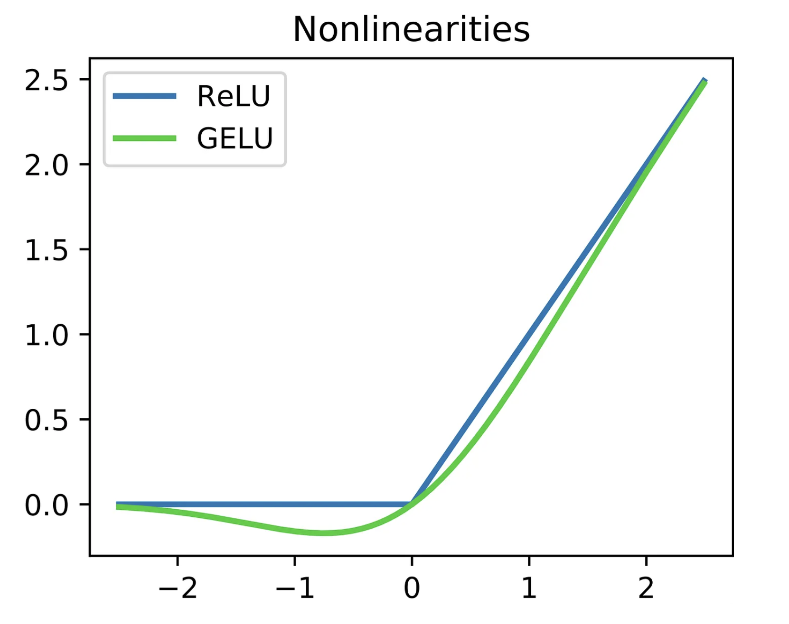

# GELU Activation Function



## Overview

This module implements the **Gaussian Error Linear Unit (GELU)** activation function used throughout the TirZ M1 Transformer architecture.

GELU is one of the most widely used activation functions in modern Large Language Models, including GPT, BERT, PaLM, and many other Transformer-based architectures.

Unlike ReLU, which either passes or blocks an input completely, GELU smoothly weights inputs according to their magnitude, enabling richer gradient flow and improved learning dynamics.

---

## Mathematical Definition

The exact GELU function is defined as:

```text
GELU(x) = x Φ(x)
```

where:

* `x` is the input value
* `Φ(x)` is the cumulative distribution function (CDF) of the standard Gaussian distribution

Since the exact computation is expensive, most Transformer implementations use the following approximation:

```text
GELU(x) ≈ 0.5x(1 + tanh(√(2/π)(x + 0.044715x³)))
```

This is the formula implemented in TirZ M1.

---

## Implementation

The implementation follows the approximation introduced in the original GELU paper.

```python
class GELU(nn.Module):
    def __init__(self):
        super().__init__()

    def forward(self, x):
        return 0.5 * x * (
            1 + torch.tanh(
                torch.sqrt(torch.tensor(2.0 / torch.pi))
                * (x + 0.044715 * torch.pow(x, 3))
            )
        )
```

---

## Why GELU?

Traditional activation functions behave differently:

| Activation | Behavior                            |
| ---------- | ----------------------------------- |
| ReLU       | Hard threshold at zero              |
| Sigmoid    | Saturates at extremes               |
| Tanh       | Can suffer from vanishing gradients |
| GELU       | Smooth probabilistic activation     |

GELU provides:

* Smooth gradients
* Better optimization stability
* Improved representation learning
* Strong empirical performance in Transformers

---

## Visualization

The graph below illustrates the behavior of the GELU activation function.

* Large positive values are mostly preserved.
* Large negative values are suppressed.
* Small values are smoothly weighted rather than abruptly removed.

Refer to:

```text
image.png
```

for the activation curve used in this repository.

---

## Applications

GELU is used extensively in:

* Transformer Networks
* Large Language Models (LLMs)
* Natural Language Processing
* Vision Transformers (ViTs)
* Deep Learning Architectures

Popular models using GELU include:

* GPT Series
* BERT
* RoBERTa
* PaLM
* LLaMA
* Gemini

---

## File Structure

```text
gelu/
│
├── GELU.py
├── image.png
└── README.md
```

---

## Purpose

The GELU activation function introduces non-linearity into the TirZ M1 model while preserving smooth gradient flow.

It plays a critical role in the Transformer's Feed Forward Network (FFN), helping the model learn complex patterns, contextual relationships, and high-level representations from text data.
