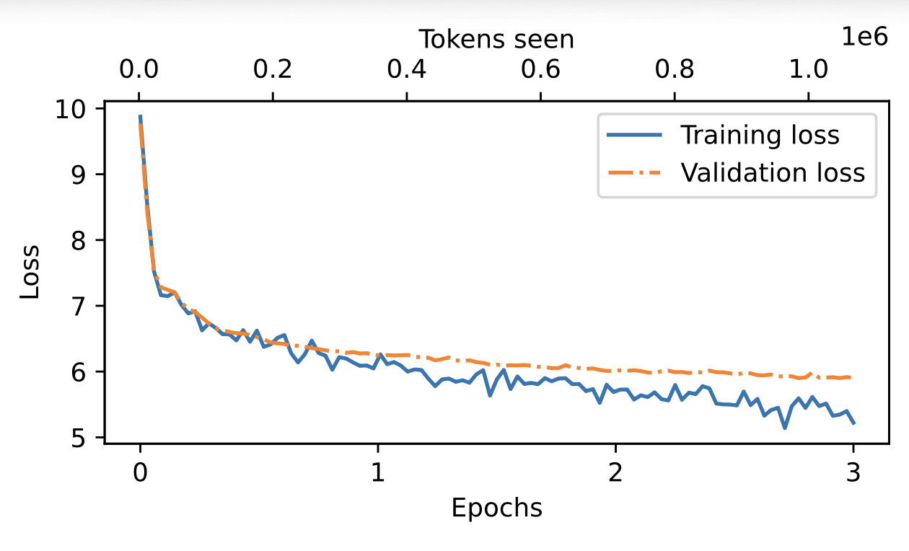

<div align="center">


# TirZ M1

**A 417M Parameter Decoder-Only Transformer Language Model**

[](https://opensource.org/licenses/MIT)
[](https://www.python.org/)
[](https://pytorch.org/)
[](#)

**Author:** [Tirth Patel](https://github.com/Tirth9978) ([@Tirth9978](https://github.com/Tirth9978))

</div>

---

## Introduction

TirZ M1 is a GPT-style decoder-only transformer language model comprising **417,887,232 trainable parameters**, designed and trained from scratch by [Tirth Patel](https://github.com/Tirth9978) ([@Tirth9978](https://github.com/Tirth9978)) under the OpenTirZ organization. Built upon the foundational principles established in the landmark "Attention Is All You Need" paper and refined through the GPT architecture lineage, TirZ M1 demonstrates that a well-engineered, moderately-sized language model can achieve meaningful text generation capabilities while remaining accessible for research, experimentation, and deployment on consumer-grade hardware. The model is trained with a next-token prediction objective using cross-entropy loss and optimized with AdamW, following a curriculum that spans 13 full epochs over a curated text corpus. TirZ M1 employs a pre-LayerNorm transformer architecture with multi-head causal self-attention, a three-layer feed-forward network with GELU activations, and top-K sampling for diverse and controllable text generation.

---

## Model Architecture

TirZ M1 follows the GPT-2-small architecture blueprint with key innovations in the feed-forward sublayer, implementing a deeper three-layer MLP expansion rather than the standard two-layer design. The model uses Pre-LayerNorm (normalization applied before the attention and feed-forward sublayers), which has been shown to improve training stability compared to the original Post-LayerNorm formulation.

### Configuration

| Hyperparameter         | Value       |
|------------------------|-------------|
| **Model Type**         | GPT (Decoder-Only Transformer) |
| **Total Parameters**   | 417,887,232 |
| **Vocabulary Size**    | 50,257      |
| **Context Length**     | 1,024       |
| **Embedding Dimension**| 768         |
| **Number of Heads**    | 12          |
| **Head Dimension**     | 64          |
| **Number of Layers**   | 12          |
| **Dropout Rate**       | 0.1         |
| **QKV Bias**           | False       |
| **Activation Function**| GELU        |
| **Layer Normalization**| Pre-LN      |
| **Tokenizer**          | BPE (GPT-2) |

### Architecture Details

#### Multi-Head Causal Self-Attention

The attention mechanism implements scaled dot-product attention with causal masking, preventing the model from attending to future tokens. Each of the 12 attention heads operates over a 64-dimensional subspace, with queries, keys, and values projected via separate linear transformations without bias terms. The output of all heads is concatenated and passed through a final linear projection layer to produce the attention output.

```
Attention(Q, K, V) = softmax(QK^T / sqrt(d_k) + Mask) × V
```

#### Feed-Forward Network (3-Layer MLP)

Unlike the standard two-layer MLP found in GPT-2, TirZ M1 employs a **three-layer feed-forward network** with progressive expansion:

```
768 → 3072 (4× expansion) → GELU → 6144 (8× expansion) → GELU → 768
```

This deeper MLP design provides richer non-linear transformations within each transformer block, enabling the model to learn more complex feature representations. The GELU activation function is implemented using the tanh approximation for computational efficiency.

#### Transformer Block

Each of the 12 transformer blocks follows the Pre-LayerNorm architecture with residual connections:

```
x → LayerNorm → Multi-Head Attention → Dropout → + (residual)
  → LayerNorm → Feed-Forward → Dropout → + (residual)
```

The pre-normalization approach applies LayerNorm before each sublayer rather than after, which has been empirically demonstrated to produce more stable gradients during training and improve convergence behavior, especially in deeper architectures.

#### Token and Positional Embeddings

TirZ M1 uses learned token embeddings and learned positional embeddings, both of dimension 768. Positional embeddings are added element-wise to token embeddings, providing the model with sequential position information. A dropout of 0.1 is applied after the embedding summation to regularize the embedding representations during training.

---

## Training

### Training Configuration

| Parameter              | Value            |
|------------------------|------------------|
| **Optimizer**          | AdamW            |
| **Learning Rate**      | 2 × 10⁻⁴        |
| **Weight Decay**       | 0.1              |
| **Batch Size**         | 2                |
| **Max Sequence Length**| 1,024            |
| **Stride**             | 1,024            |
| **Number of Epochs**   | 13               |
| **Train/Val Split**    | 90% / 10%        |
| **Random Seed**        | 123              |
| **Evaluation Frequency**| Every 5 steps   |

### Training Loss Curves

The model was trained for 13 epochs, with training and validation losses evaluated every 5 steps. The loss curves demonstrate steady convergence from an initial training loss of ~9.87 down to ~5.22, and validation loss from ~9.77 to ~5.91.

<div align="center">

</div>

### Training Log Summary

| Epoch | Step  | Train Loss | Val Loss |
|-------|-------|------------|----------|
| 1     | 0     | 9.875      | 9.769    |
| 1     | 50    | 6.733      | 6.731    |
| 1     | 100   | 6.513      | 6.429    |
| 1     | 170   | 6.047      | 6.258    |
| 2     | 210   | 5.893      | 6.210    |
| 2     | 280   | 5.812      | 6.099    |
| 2     | 340   | 5.800      | 6.010    |
| 3     | 400   | 5.679      | 5.977    |
| 3     | 460   | 5.416      | 5.955    |
| 3     | 520   | 5.222      | 5.905    |

The complete training log with per-step metrics is available in [`training_log.txt`](training_log.txt).

---

## Text Generation

TirZ M1 supports two generation strategies:

### Greedy Decoding

Selects the most probable next token at each step. Produces deterministic and focused outputs.

```python
token_ids = generate_text_simple(
    model=model,
    idx=encoded_input,
    max_new_tokens=50,
    context_size=1024
)
```

### Top-K Sampling

Samples from the top-K most probable tokens at each step, introducing controlled randomness for more diverse and creative outputs.

```python
token_ids = generate_text_simple_with_top_k(
    model=model,
    idx=encoded_input,
    max_new_tokens=50,
    context_size=1024,
    top_k=50   # or top_k=10 for more focused output
)
```

---

## Quick Start

### Installation

```bash
git clone https://github.com/OpenTirZ/TirZ-M1.git
cd TirZ-M1
pip install torch tiktoken matplotlib
```

### Inference

```python
import torch
import tiktoken
from main import TirZM1, TirZ_M1, text_to_toekn_ids, token_ids_to_text, generate_text_simple_with_top_k

# Load model configuration
model = TirZM1(TirZ_M1)

# Load trained weights
checkpoint = torch.load("model.pth", map_location="cpu")
model.load_state_dict(checkpoint["model_state_dict"])
model.eval()

# Tokenizer
tokenizer = tiktoken.get_encoding("gpt2")

# Generate text
input_text = "Every effort moves you"
encoded = text_to_toekn_ids(input_text, tokenizer)

output_ids = generate_text_simple_with_top_k(
    model=model,
    idx=encoded,
    max_new_tokens=100,
    context_size=TirZ_M1["context_length"],
    top_k=50
)

print(token_ids_to_text(output_ids, tokenizer))
```

### Training from Scratch

```python
python main.py
```

This will:
1. Load and prepare the dataset
2. Initialize the TirZ M1 model with 417M parameters
3. Train for 13 epochs with AdamW optimizer
4. Save training logs to `training_log.txt`
5. Generate loss curve plots
6. Save the model checkpoint to `model.pth`

---

## Repository Structure

```
TirZ-M1/
├── main.py                      # Main training & inference script
├── training_log.txt             # Per-step training/validation loss log
├── Logo.png                     # TirZ M1 model logo
├── plot.png                     # Training & validation loss curve (PNG)
├── loss-plot.pdf                # Training & validation loss curve (PDF)
├── LICENSE                      # MIT License
├── Activation/
│   └── GELU.py                  # GELU activation (tanh approximation)
├── Attention/
│   └── MultiHeadAttention.py    # Multi-head causal self-attention
├── Creating_Data_set/
│   └── DataSet.py               # Dataset creation & DataLoader utility
├── Data/
│   └── data.py                  # Data loading & preprocessing
├── FeedForward/
│   └── FeedForward.py           # 3-layer MLP feed-forward network
├── LayerNorm/
│   └── LayerNorm.py             # Layer normalization
└── Transformer/
    ├── TransformerBlock.py      # Pre-LN transformer block with residuals
    └── README.md                # Transformer module documentation
```

---

## Model Checkpoint

The trained model checkpoint (`model.pth`) includes:

| Key                   | Description                              |
|-----------------------|------------------------------------------|
| `model_state_dict`    | All trained model weights                |
| `optimizer_state_dict`| AdamW optimizer state for resumable training |
| `config`              | Full model configuration dictionary      |
| `num_epochs`          | Number of training epochs completed      |
| `tokens_seen`         | Total tokens processed during training   |

---

## Technical Highlights

- **Three-Layer Feed-Forward MLP**: Unlike the standard two-layer MLP in GPT-2 (768 → 3072 → 768), TirZ M1 uses an expanded three-layer architecture (768 → 3072 → 6144 → 768) with dual GELU activations. This design provides greater representational capacity within each transformer block, allowing the model to capture more intricate patterns in the data. The progressive expansion and contraction of the hidden dimension creates a bottleneck-then-expand-then-project pathway that enriches the feature transformations at each layer.

- **Pre-LayerNorm Architecture**: Layer normalization is applied before the self-attention and feed-forward sublayers rather than after them. This design choice, validated by subsequent research on transformer training dynamics, produces more stable gradient flow throughout the network and mitigates the risk of training instabilities that can arise in deeper models with post-normalization configurations.

- **Causal Attention Masking**: A strict upper-triangular mask ensures that each token can only attend to itself and preceding tokens, enforcing the autoregressive property essential for language modeling. This is implemented using `torch.triu` with a registered buffer for efficient computation during both training and inference.

- **Top-K Sampling**: Beyond standard greedy decoding, TirZ M1 implements top-K sampling which filters the logits to only the K most probable tokens before applying softmax and multinomial sampling. This provides a tunable trade-off between coherence and diversity in generated text, with lower K values producing more focused outputs and higher K values enabling more creative generation.

- **Custom LayerNorm and GELU**: Both LayerNorm and GELU are implemented from scratch rather than using PyTorch's built-in modules, providing full transparency into the mathematical operations and enabling fine-grained control over numerical precision and behavior. The GELU uses the computationally efficient tanh approximation: `0.5 * x * (1 + tanh(sqrt(2/π) * (x + 0.044715 * x³)))`.

---

## Limitations

- **Model Scale**: At 417M parameters, TirZ M1 is a relatively small language model by contemporary standards. It may not perform well on tasks requiring extensive world knowledge, complex reasoning, or highly specialized domain expertise. The model is best suited for research, educational purposes, and as a foundation for further scaling and fine-tuning.

- **Training Data Coverage**: The model's capabilities are directly bounded by the breadth and diversity of its training corpus. It may exhibit biases present in the training data and may struggle with out-of-distribution inputs or low-resource languages and domains.

- **Context Window**: The maximum context length of 1,024 tokens limits the model's ability to process and generate long-form content that requires maintaining coherence over extended passages. This constraint is inherent to the architecture's positional embedding design.

- **No Instruction Tuning**: TirZ M1 is a base language model trained with a next-token prediction objective. It has not been fine-tuned for instruction following, conversation, or alignment with human preferences. Outputs may be grammatically coherent but semantically unfocused without additional fine-tuning.

---

## Citation

If you use TirZ M1 in your research or projects, please cite it as:

```bibtex
@misc{tirzm1,
  title={TirZ M1: A 417M Parameter Decoder-Only Transformer Language Model},
  author={Tirth Patel},
  howpublished={\url{https://github.com/Tirth9978}},
  year={2026},
  publisher={GitHub},
  url={https://github.com/OpenTirZ/TirZ-M1}
}
```

---

## License

This project is licensed under the [MIT License](LICENSE).

---

<div align="center">

**TirZ M1** — Built with conviction by [Tirth Patel](https://github.com/Tirth9978) ([@Tirth9978](https://github.com/Tirth9978)) | [OpenTirZ](https://github.com/OpenTirZ)

</div>
